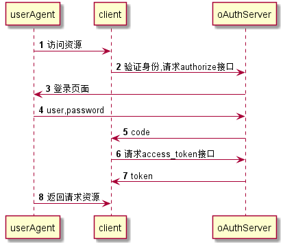

[TOC]
## 授权流程




##用户信息

获取登录用户信息

###URL
`http://center.wise-mate.com/api/userInfo`
###请求方式
`GET`
###请求参数
####headers
|               | 必选   | 类型     | 说明        |
| ------------- | ---- | ------ | --------- |
| Authorization | true | string | tokenCode |
###请求示例
```sh
curl -i -X GET -H "Authorization:db4a928b573551748f463440104adceb" 'http://center.wise-mate.com/api/userInfo'
```
###请求结果
####正确
```json
{
    "successful": true,
    "result": {
        "loginName": "admin",
        "userId": "1001",
        "username": "系统管理员"
    }
}
```
####错误
```json
{
    "successful": false,
    "code": "999",
    "error": "错误tokenCode"
}
```

##当前用户的控件资源

查询用户已拥有的页面控件权限，只显示拥有权限的控件。

###URL
`http://center.wise-mate.com/api/user/menuPerms`
###请求方式
`GET`
###请求参数
####headers
|               | 必选   | 类型     | 说明                     |
| ------------- | ---- | ------ | ---------------------- |
| Authorization | true | string | access_token接口获取的token |
###请求示例
```sh
curl -i -X GET \
   -H "Authorization:1c533e44642a5b5fd0f5faff8f428d90" \
 'http://center.wise-mate.com/api/user/menuPerms'
```
####正确
```json
{
    "successful": true,
    "result": [
        {
            "id": "110",
            "icon": "laptop",
            "name": "控制台",
            "router": "/",
            "type": "MENU",
            "seq": "110"
        },
        {
            "id": "9992",
            "mpid": "999",
            "bpid": "999",
            "icon": "team",
            "name": "角色管理",
            "router": "/roles",
            "type": "MENU",
            "seq": "9992"
        },
        {
            "id": "99921",
            "mpid": "-1",
            "bpid": "9992",
            "icon": "save",
            "name": "新增",
            "router": "",
            "type": "BUTTON",
            "seq": "99921"
        },
        {
            "id": "99923",
            "mpid": "-1",
            "bpid": "9992",
            "icon": "edit",
            "name": "编辑",
            "router": "",
            "type": "BUTTON",
            "seq": "99923"
        }
    ]
}
```
####错误
```json
{
    "successful": false,
    "code": "999",
    "error": "错误tokenCode"
}
```

##OAuth2的authorize接口
###URL
`http://center.wise-mate.com/api/oauth/authorize`
###http请求方式
`GET/POST`aa
###请求参数
|               | 必选   | 类型     | 说明                     |
| ------------- | ---- | ------ | ---------------------- |
| client_id     | true | string | 申请应用时分配的AppKey。        |
| redirect_uri  | true | string | 授权回调地址，站外应用需与设置的回调地址一致 |
| response_type | true | string | 响应类型。目前仅支持code         |
###请求示例
```sh
curl -i -X GET \
 'http://center.wise-mate.com/api/oauth/authorize?client_id=b5ccdce8-5a46-4356-985b-89d0047d2d99&redirect_uri=http://127.0.0.1:8080/cmbc/oauth2-login&response_type=code'
```

###返回数据
####成功
```json
${redirect_uri}&code=${code}
```
|             | 类型     | 说明                                       |
| ----------- | ------ | ---------------------------------------- |
| code        | string | 用于第二步调用oauth2/access_token接口，获取授权后的access token。 |
| redirectUri | string | 申请应用时配置的回调地址                             |
##OAuth2的access_token接口

###URL
http://center.wise-mate.com/api/accessToken
###http请求方式
`POST`
###请求参数
|               | 必选   | 类型     | 说明                         |
| ------------- | ---- | ------ | -------------------------- |
| client_id     | true | string | 登录名                        |
| client_secret | true | string | 申请应用时分配的AppSecret。         |
| grant_type    | true | string | 请求的类型，填写authorization_code |
- **grant_type为authorization_code时**

|              | 必选   | 类型及范围  | 说明                    |
| ------------ | ---- | ------ | --------------------- |
| code         | true | string | 调用authorize获得的code值。  |
| redirect_uri | true | string | 回调地址，需需与注册应用里的回调地址一致。 |

###请求示例

```sh
curl -i -X POST \
   -H "Content-Type:application/x-www-form-urlencoded" \
   -d "client_id=b5ccdce8-5a46-4356-985b-89d0047d2d99" \
   -d "client_secret=43c4dae6-7e11-4d74-a74a-e2da77c79b18" \
   -d "grant_type=authorization_code" \
   -d "code=490172c5efebe0bf2d9c80011745b9e7" \
   -d "redirect_uri=http://127.0.0.1:8080/cmbc/oauth2-login" \
 'http://center.wise-mate.com/api/accessToken'
```
###返回数据
####成功
```json
{
    "access_token": "78b57346a5a9ba644ef63b2732f89640",
    "refresh_token": "af5cea35f957e1bf9b1f8a629e23d6d6",
    "expires_in": 648000,
    "userId": "1001"
}
```
####失败
```json
{
    "error_description": "Invalid client_id 'b5ccdce8-5a46-4356-985b-89d0047d2d991'",
    "error": "invalid_client"
}
```